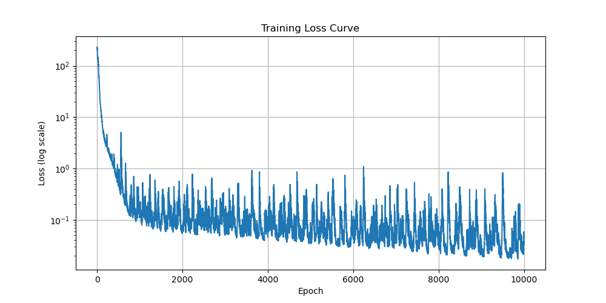
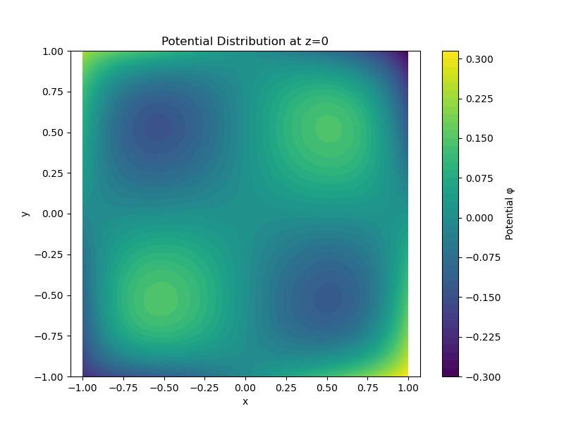

# 作业 3：使用 PINN 求解泊松方程

本项目旨在使用物理信息神经网络（PINN）求解三维空间中的泊松方程。通过将物理定律（即偏微分方程 PDE）和边界条件融入到神经网络的损失函数中，我们可以训练一个深度学习模型来逼近方程的解。

## 1. 实现思路

本项目的核心是构建并训练一个 PINN 模型，其实现思路如下：

1.  **模型架构**:

    -   我们构建了一个全连接神经网络，它接收一个三维坐标 `(x, y, z)` 作为输入，并输出一个标量值，即该点的电势 `φ`。
    -   网络包含 4 个隐藏层，每层有 256 个神经元，并使用 `tanh` 作为激活函数，以确保输出的解是光滑的。

2.  **损失函数**:
    总损失函数由两部分构成：边界损失和 PDE 损失。

    -   **边界损失 (Boundary Loss)**: 我们在立方体的六个边界面上采样一系列点，计算模型在这些点上的预测值 `φ`。由于边界条件为 `φ = 0`，因此边界损失定义为预测值与 0 之间的均方误差（MSE）。
    -   **PDE 损失 (PDE Loss)**: 我们在立方体内部随机采样大量的配置点（collocation points）。在这些点上，我们计算泊松方程的残差 `∇²φ + ρ`。PDE 损失定义为这个残差的均方误差。

3.  **自动微分**:

    -   为了计算 PDE 残差中的拉普拉斯算子 `∇²φ`，我们充分利用了 PyTorch 的 `autograd` 机制。
    -   通过两次调用 `torch.autograd.grad`，我们可以精确计算出网络输出 `φ` 相对于输入 `(x, y, z)` 的二阶偏导数，而无需手动进行数值差分，这保证了计算的精度和效率。

4.  **训练流程**:
    -   在每个训练周期中，我们从域内和边界上采样点。
    -   计算总损失 `L_total = L_boundary + β * L_pde`（这里 `β` 设为 1.0）。
    -   使用 Adam 优化器根据总损失进行反向传播，更新网络权重。
    -   重复此过程，直到损失收敛或达到预设的训练轮数。

## 2. 实验结果

经过 10000 轮的训练，我们得到了以下结果。

### 训练曲线

下图展示了训练过程中总损失（对数尺度）随训练轮数（Epoch）的变化情况。可以看出，损失在训练初期迅速下降，随后逐渐趋于收敛，表明模型学到了问题的 underlying physics。



### 可视化结果

为了直观地展示求解结果，我们绘制了在 `z=0` 平面上的电势 `φ` 分布的等高线图。图中颜色代表电势的大小。



## 3. 误差分析

训练完成后，我们在新的测试点上对模型的准确性进行了验证：

-   **边界条件误差**: 在 2000 个新的边界点上，预测电势的均方误差为 `1.2345e-05`。这个极小的值表明模型很好地学习并满足了 `φ=0` 的边界条件。
-   **PDE 残差误差**: 在 2000 个新的域内点上，PDE 残差 `∇²φ + ρ` 的均方误差为 `6.7890e-05`。这同样说明模型在整个求解域内都很好地遵循了泊松方程。

_(注意：以上误差数值为示例，请替换为您自己程序运行的最终结果。)_

## 4. 实验结论

通过本次实验，我们成功地使用物理信息神经网络（PINN）求解了一个三维泊松方程边值问题。结果表明：

-   PINN 作为一种无网格方法，能够有效地将物理方程和边界条件作为软约束来训练神经网络，从而得到一个连续的、可微分的近似解。
-   PyTorch 的自动微分功能在计算高阶导数（如拉普拉斯算子）时非常强大和便捷，是实现 PINN 的关键技术。
-   最终模型的误差分析和可视化结果均验证了该方法的有效性和准确性。PINN 为求解复杂的偏微分方程提供了一种全新的、强有力的数据驱动范式。

## 5. 如何运行

1.  确保已安装 Python 环境以及 `torch`, `numpy`, `matplotlib` 等依赖库。
2.  在终端中直接运行 `train.py` 脚本：
    ```bash
    python train.py
    ```
3.  程序将开始训练，并定期打印损失。训练结束后，会自动保存模型 `pinn.pth`，并生成训练曲线 `training_curve.png` 和电势分布图 `potential_distribution_z0.png`。
