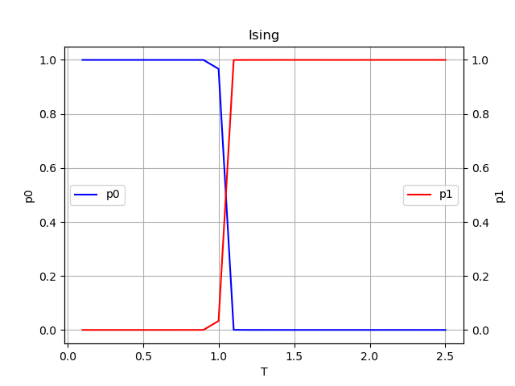

# Assignment 5: Ising Model Phase Classification

## 运行过程

1.  **环境准备**: 确保安装了 `numpy` 和 `matplotlib`。
2.  **运行代码**: 在终端执行 `python IsingModel.py`。
    -   程序首先检查是否存在 `Ising_dataset.npy`。如果存在，直接加载数据，这大大缩短了运行时间。
    -   如果不存在，程序会通过 Monte Carlo 模拟生成训练和测试数据（这可能需要较长时间）。
    -   接着，程序构建并训练一个全连接神经网络。
    -   最后，程序在 $0.1 T_c$ 到 $2.5 T_c$ 的温度范围内生成新样本进行测试，并绘制相图。
3.  **输出**: 运行结束后，生成了相图文件 `Ising.png` 和保存的模型 `Ising_ANN.pkl`。

## 结果展示

## 结果分析

-   **铁磁相 (Ferromagnetic Phase)**:

    -   对应于低温区域 ($T/T_c < 1$)。
    -   在相图中，蓝色曲线 (`p0`) 表示模型预测为铁磁相的概率。可以看到在 $T < 1$ 时，`p0` 接近 1.0，说明神经网络能够准确识别出有序的自旋构型。

-   **顺磁相 (Paramagnetic Phase)**:

    -   对应于高温区域 ($T/T_c > 1$)。
    -   在相图中，红色曲线 (`p1`) 表示模型预测为顺磁相的概率。在 $T > 1$ 时，`p1` 接近 1.0，说明网络识别出了无序的自旋状态。

-   **临界温度 (Critical Temperature)**:
    -   理论上的临界温度位于 $T/T_c = 1$。
    -   观察相图，`p0` 和 `p1` 两条曲线在 $T \approx 1$ 附近发生交错。
    -   尽管神经网络仅在远离临界点的数据上进行训练（$T < 0.8$ 和 $T > 1.2$），但它能够较好地泛化，并在临界温度附近表现出相变的特征（概率的急剧变化）。这表明神经网络成功学习到了区分有序和无序状态的关键特征（如磁化强度或畴结构）。
